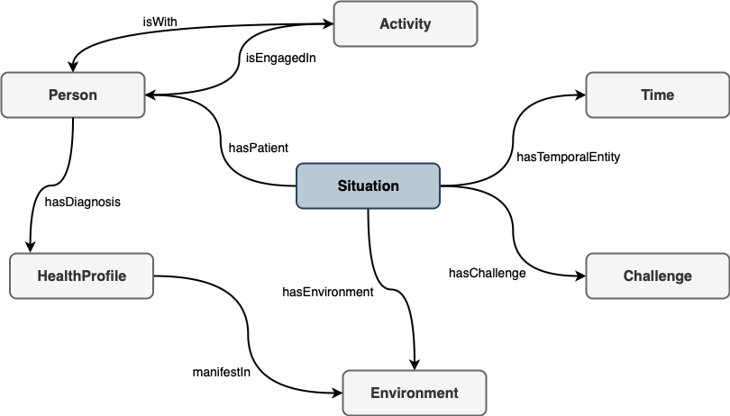
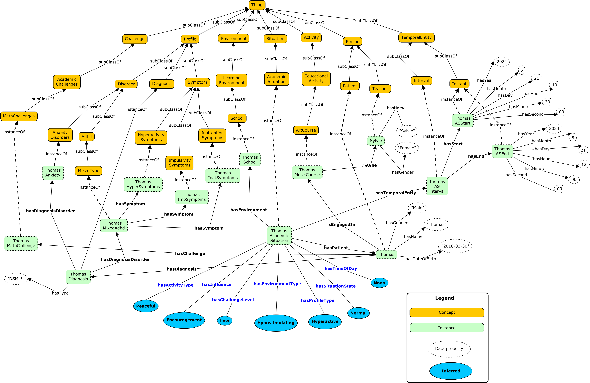
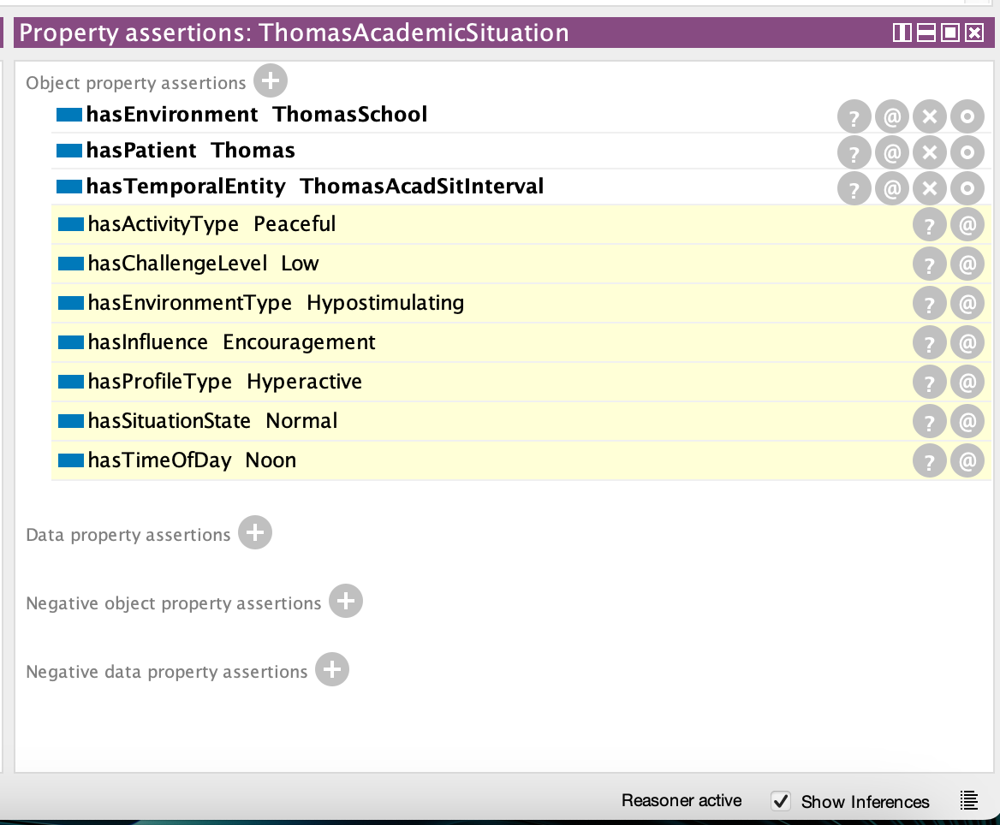
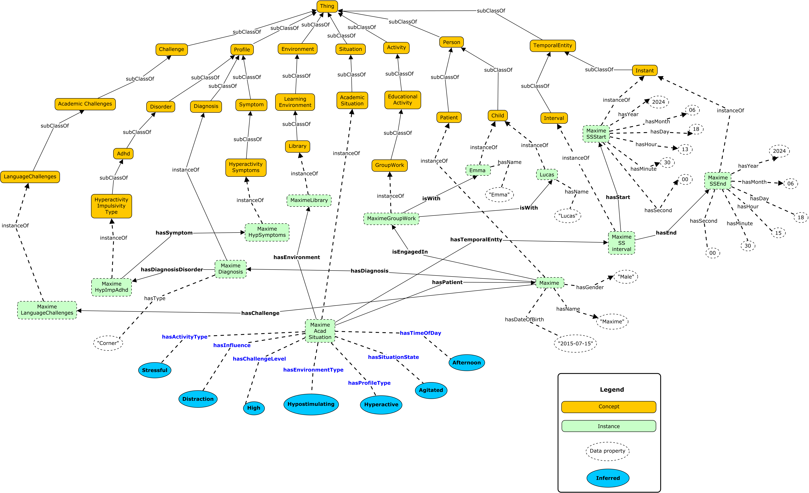
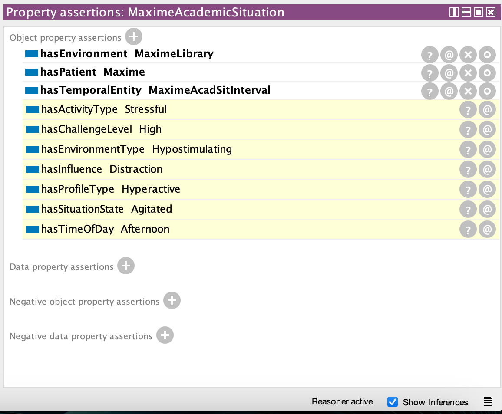
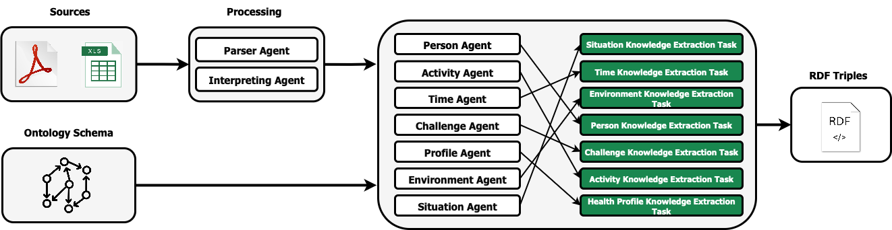
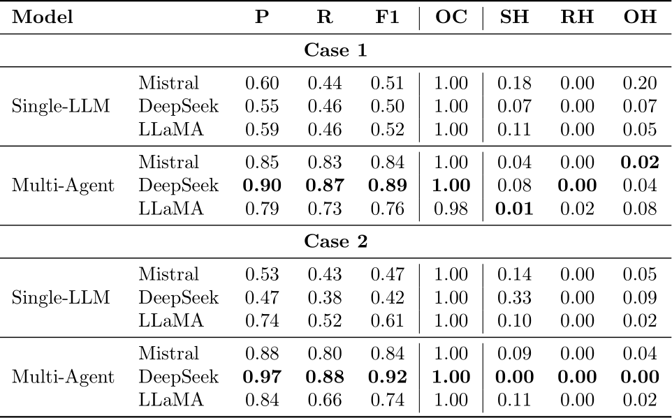
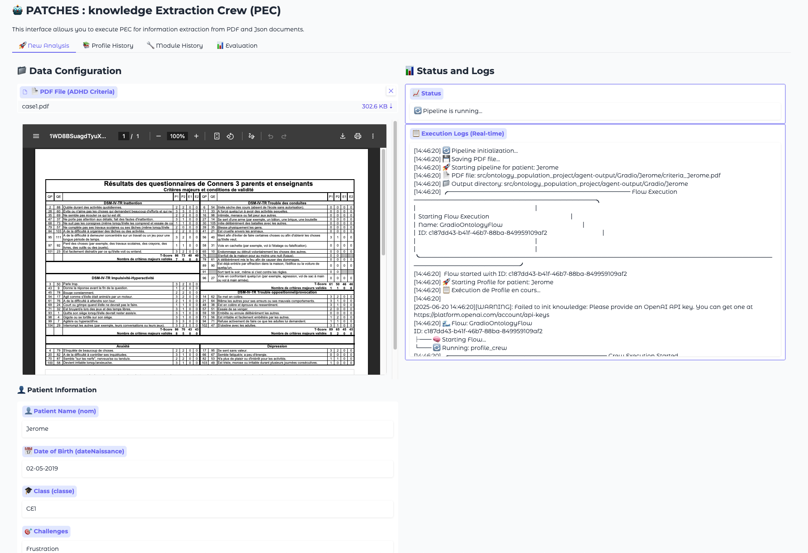
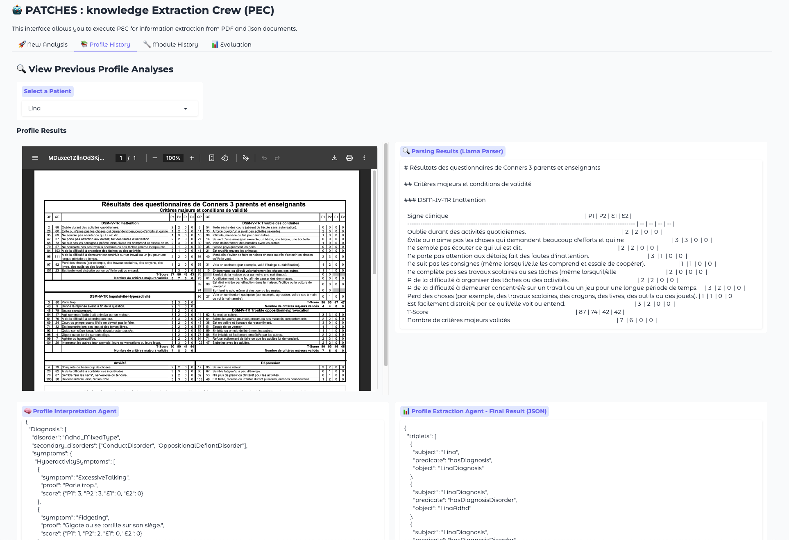
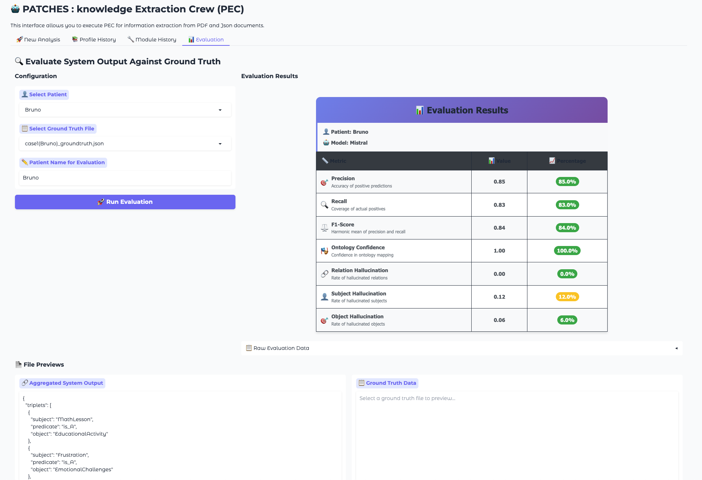

# A Semantic Framework for the Contextual Interpretation of ADHD Symptom Manifestations

This is the repository for `A Semantic Framework for the Contextual Interpretation of ADHD Symptom Manifestations`.
This study introduce a complete framework designed to support clinical reasoning for interpreting the manifestations of ADHD symptoms.

For further information regarding ADHD and its situational variability, please visit the following links :
- https://psychiatryonline.org/doi/10.1176/appi.pn.2021.10.20
- https://www.psychiatry.org/patients-families/adhd/what-is-adhd

**Note:** Due to the confidentiality of medical data, all personal patient information has been replaced with fictitious data.

---

## 🔗 The semantic Model



---

## 🔎 Experimentation of the ontology model 
We illustrate how our semantic model can interpret two situations involving patients with ADHD.


### Scenario 1:
*Thomas is a boy born on March 30, 2018, diagnosed with mixed-type ADHD according to the DSM-5, and he also exhibits anxiety disorders. He has difficulties in mathematics. On May 21, 2024, at 10:30 a.m., he was in class for a music lesson with teacher Sylvie.*

The following image illustrates the representation of this situation through our PATCHES model. The inference results (blue) represent individuals.


The following image illustrates the inference results for this scenario in Protégé.
By applying rules 1, 4, 12, 17, 21, 24, and 27, the conclusion is that, in the current situation, there is a low probability that Thomas will exhibit ADHD symptoms.


---

### Scenario 2:
*Maxime is a boy born on July 15, 2015, diagnosed with hyperactive-impulsive type ADHD according to Corner’s criteria. He encounters difficulties in language classes. On June 18, 2024, at 1:30 p.m., he participates in group work on a language lesson with his friends Emma and Lucas at the library.*

The following image illustrates the representation of this situation through our PATCHES model. The inference results (blue) represent individuals.


The following image illustrates the inference results for this scenario in Protégé.
By applying rules 1, 4, 11, 18, 19, 23, and 25, the conclusion is that, in the current situation, Maxime is likely to exhibit symptoms of hyperactivity.


---

## 🤖 The population system
It represents the multi-agent system used to automatically identify and extract information from various sources and integrate it into our ontology.



### 🛠️ Implementation details and Agents design

T. Guo et al. ([paper](https://arxiv.org/abs/2402.01680)) and Z. Duan et al. ([paper](https://arxiv.org/abs/2411.18241)) present several open-source multi-agent frameworks.
We selected CrewAI from among the available open-source frameworks for its modular and flexible architecture, which aligns well with the requirements of our multi-agent system.
CrewAI enables the creation of agents with distinct roles, supports automated task delegation, and facilitates the orchestration of complex workflows capabilities that are particularly well-suited for the automatic population of a modular ontology.
The following present the key components of our multi-agent system :
* **Document Parser** : We employed [LLamaParse](https://www.llamaindex.ai/llamaparse) as a document parser to convert PDF documents containing tables and charts into structured data suitable for our agents.
* **Prompt Design for Agents** : Prompting is a key factor in the performance of LLM agents. In our system, each agent’s role, behavior, and assigned task are defined using a YAML configuration, as described in Section 3.4 of our paper. While automatic prompt optimization methods (e.g., APO) exist, their use in multi-agent systems remains complex due to inter-agent dependencies and limited reward signals (see H. Zhou et al.,[ref](https://arxiv.org/abs/2502.02533)). We therefore chose a manual prompt design approach, offering better control and suitability for our scenario.
  Each task-specific prompt includes :
    * Clear task instructions
    * Relevant ontology concepts and relations (from the ontology)
    * Few-shot annotated examples
    * The specific instance to be processed

* **Agent** : Each agent is an LLM guided by precise instructions and enhanced with appropriate tools, dedicated to one or more ontological modules.
* **Task** : A task encapsulates all the requisite execution specifics, including a detailed description, the designated agent, the necessary tools, and other pertinent parameters, thereby enabling a diverse spectrum of action complexities.

### 📋 Results of Knowledge extraction using the population system

Our experimental evaluation is based on data from two ADHD-diagnosed patients.
Diagnostic reports were collected in collaboration with a doctor, in PDF format. The information about planning is in Excel format. Check the experimentation files in `./experimentation_data/`.
The following table present for each case, the value of Precision (P), Recall (R), F1-score, Ontology Conformance (OC), Subject/Relation/Object Hallucinations (SH/RH/OH).
Numbers in bold identify the best results for each case.



---
## ⚡️ Repo content
The structure of the repo is as the following :
- [experimentation data](experimentation_data) : Contains the source documents used for ontology population. This includes medical diagnostic reports in PDF format and activity schedules in Excel format.
- [ontology](ontology) : The modular ontology (OWL) used in this study.
- [src](src) : Contains the code of our multi-agent system. As the medical reports we process are in French, the prompts have been designed in the same language.
    - [parsing tool](src/ontology_population_project/tools/parsing_tool.py): We use [LLamaParse](https://www.llamaindex.ai/llamaparse), an LLM-powered tool integrated into the agent workflow to extract structured text from PDF medical reports. It serves as the initial step in the knowledge extraction pipeline.
    - agents configuration ([file 1](src/ontology_population_project/crew/profile_crew/config/agents.yaml), [file 2](src/ontology_population_project/crew/modules_crew/config/agents.yaml)): Each agent is configured using YAML syntax that defines its role, objectives, and behavioral instructions. This modular setup allows precise control over the agent’s actions.
    - task configuration ([file 1](src/ontology_population_project/crew/profile_crew/config/tasks.yaml), [file 2](src/ontology_population_project/crew/modules_crew/config/tasks.yaml)): Tasks are also defined via YAML. Each task includes the agent responsible, a description, and the tools required, enabling flexible and scalable task orchestration.
    - [pydantic types](src/ontology_population_project/pydantic_types): We leverage Pydantic models for semantic control. These models ensure that each agent operates strictly within the ontological schema associated with its module. This constraint minimizes semantic drift and improves the relevance and consistency of the extracted outputs.
- Configuration Files:

    - `pyproject.toml`: Defines the python project structure and lists the required dependencies for running the application using the `crewAI` framework.
    - `Dockerfile`: Specifies the instructions to build the Docker image, including the installation of necessary dependencies, tools, and environment setup for the ontology population system.
    - `docker-compose.yml`: Orchestrates multiple Docker containers and services, including the application itself, LLM dependencies, and any supporting services, providing a unified environment for development and deployment.
    - `entrypoint.sh`: A shell script that contains startup commands automatically executed when the containers are launched. It ensures that necessary services and environment variables are initialized correctly before the application starts.

### ✅ Installation
Prerequisites :
* Docker

#### How to Run the Code

To run the application, follow these steps:

1.  (Optional) Create the `.env` file from the provided example:

2. (Optional) Set the API keys in the `.env` file:

    * The LLM API key (e.g., `MISTRAL_API_KEY`)
    * The LLamaParse API key (`LLAMA_CLOUD_API_KEY`)

3. Build and start the Docker container using the following command:

   ```bash
   docker-compose up --build
   ```
**Note:** This command will automatically build the Docker image, create the container, and install all necessary dependencies for the application.

Once the process completes successfully, you can directly access the Gradio interface and:

* **View the results of our experiments** via the **Profile History** and **Module History** tabs.
* **Re-run the evaluation** of these experiments using the **Evaluation** tab to visualize the outcomes.


#### Manual Execution in the Docker Container

To manually connect to the container and run the code:

   ```bash
   docker-compose start
   ```

You can directly access the Gradio interface.

### 🌐 Launch the Gradio interface in your browser
Once Gradio is launched, open your browser at the following address:

```bash
http://localhost:7860
```
Description of Gradio Interface Tabs :

* **New Analysis Tab**:
  This tab allows you to run the complete knowledge extraction pipeline from a PDF medical report and a planning file in Excel format (Check the example files in `./experimentation_data/`). To launch the process, follow these steps:

    * Select the medical report in PDF format (*PDF File* section).
    * Enter the patient's **information** (*Patient Information* section).
    * Select the planning file in Excel format (*Planning Data* section).
    * Click the **Launch Pipeline** button to start the knowledge extraction process.

* **Profile History Tab**:
  This tab displays previously generated results for the *Profile* module. It allows you to review past extractions without re-running the pipeline. Several of our experimental cases are already included.

* **Module History Tab**:
  This tab shows previously generated results for the other modules (*Activity, Challenge, Person, Environment, Time,* and *Situation*). It enables result viewing without repeating the extraction process. Some of our experimental cases are preloaded.

* **Evaluation Tab**:
  This tab allows you to evaluate the LLM-generated outputs against manually defined ground-truth data. It also includes several of our experimental evaluation results.

### 🖥️ Illustrations from the Experimentation Phase
This section presents a selection of screenshots from the experiments we conducted. These images illustrate key steps and outputs of the system, providing a visual overview of the implementation and results.

* This screenshot shows the web interface used to upload PDF and Excel files, which triggers the instance extraction process using our multi-agent system.
  


* The second screenshot displays the interface for visualizing the extraction results, allowing users to inspect the outputs generated by the agents.



* The third screenshot shows the interface for re-running the evaluation process and visualizing the corresponding results.




### ⚙️ Result Reproduction

The following instructions describe how to execute the complete pipeline, from document parsing to triplet extraction. Please note that results generated by LLMs may vary.

1. **API Key Configuration**: Set the API keys in the `.env` file:

    * The LLM API key (e.g., `MISTRAL_API_KEY`)
    * The LLamaParse API key (`LLAMA_CLOUD_API_KEY`)

2. **Ground Truth for Evaluation**:
   To perform evaluation, manually define the ground truth in JSON format and place it in the following folder:
   `src/ontology-population-project/agent-output/Gradio/ground-truth`.

3. **Container Setup**:
   Create or start the Docker container using the command provided earlier in this README.

4. **Access the Gradio Interface**:
   Open the Gradio interface using the link mentioned above.


